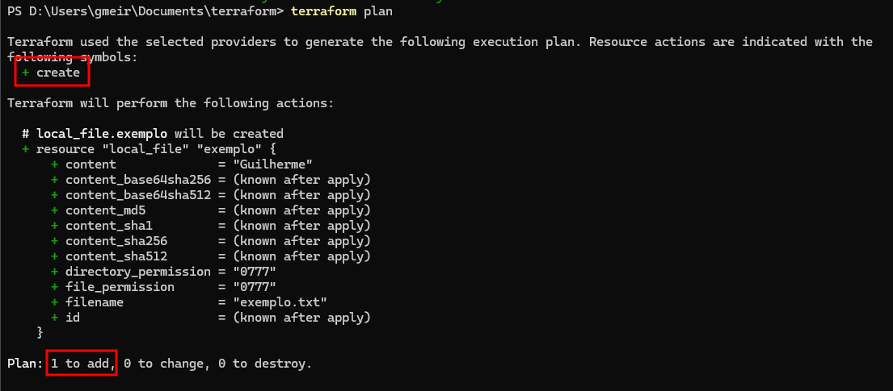
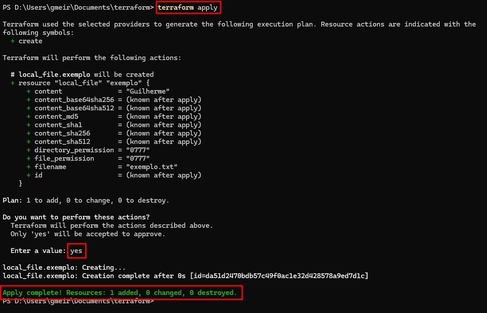
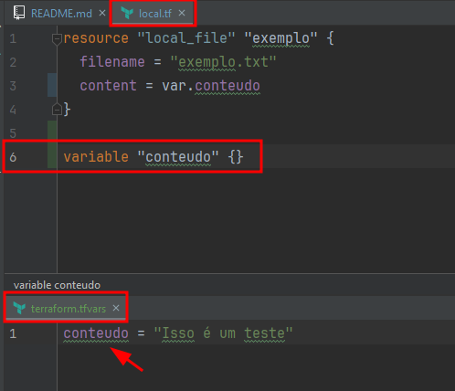
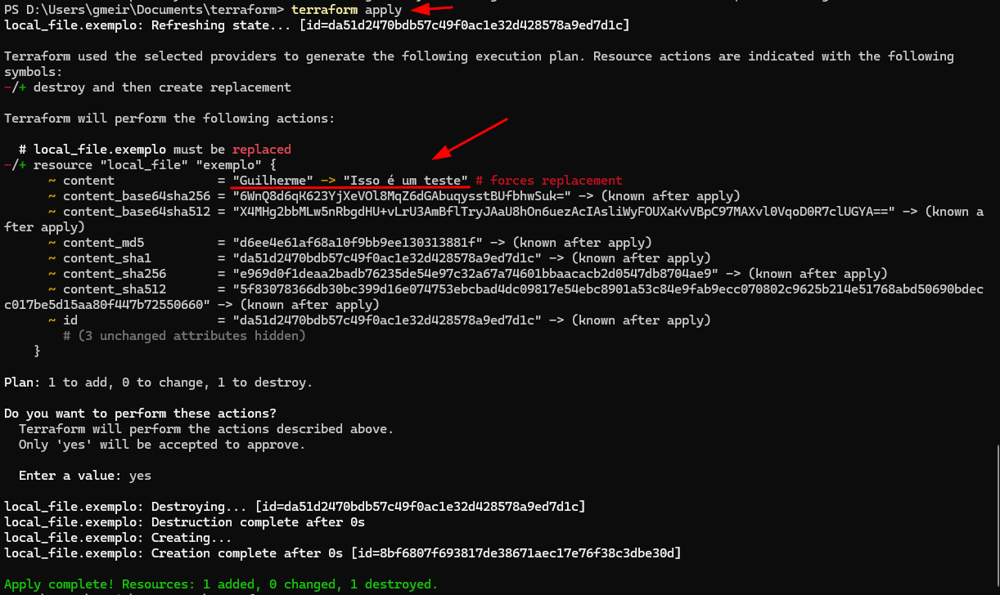
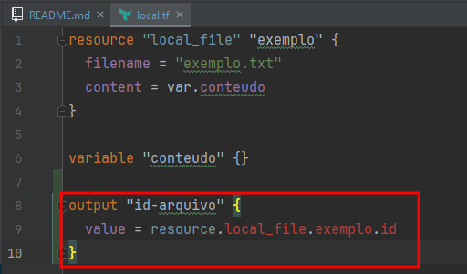
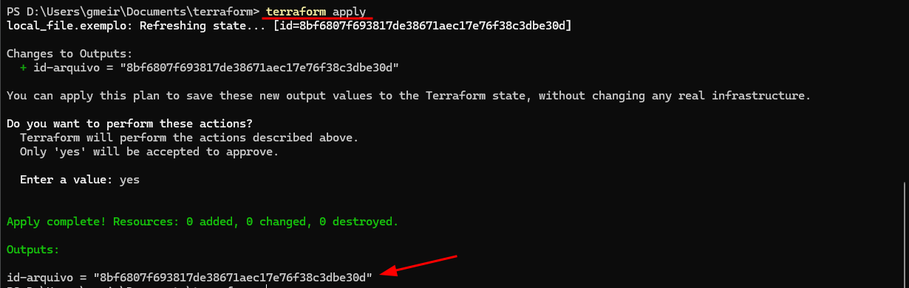
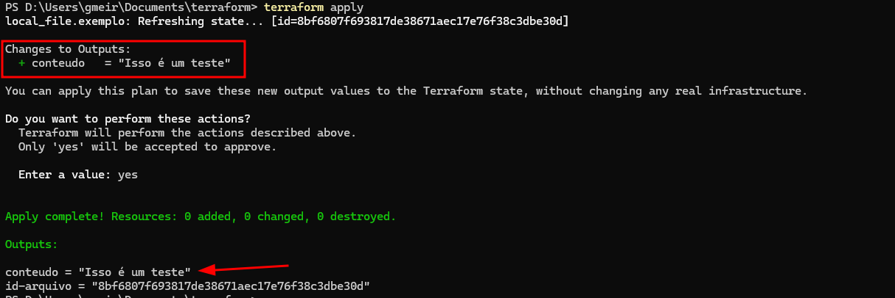

# Terraform

## O que é?

Com o Terraform, é possível descrever a infraestrutura desejada em arquivos de configuração, chamados
de `código Terraform`, e o Terraform se encarrega de **criar e gerenciar** esses recursos de forma **eficiente e escalável**.

Ele **suporta diversos provedores de nuvem**, como AWS, Azure, Google Cloud, entre outros, **facilitando a criação e manutenção**
de ambientes de infraestrutura de maneira consistente e reprodutível.

## Instalando o Terraform

Download: https://developer.hashicorp.com/terraform/install?ajs_aid=c91f7989-f34f-46bf-86f8-a2a8f8e103d4&product_intent=terraform

**Caso seja Windows, siga os passos abaixo:**

- Extraia a pasta do Terraform e copie o diretório.
- Abra as variáveis de ambiente e em `Variáveis do sistema`, abra a variável `Path`.
- Cole o caminho do diretório em uma nova linha do `Path`.
- Abra o Prompt de Comando e digite `terraform -v` para checar a instalação.

## Iniciando...

Vamos utilizar o arquivo `local.tf`, em que ele vai criar um resource de `local_file`.

Para rodar o terraform, vamos utilizar o comando: `terraform init`.
> Com isso, ele baixará o resource `local_file` do hashicorp e criará uma pasta oculta para salvar os dados baixados.

Para ver os providers que serão gerados, podemos executar o comando: `terraform plan`, e ele informará qual a ação de cada recurso:

Para aplicarmos esse recurso, utilize o comando: `terraform apply` e digite `yes` para confirmar.

Com isso, podemos verificar na **raiz do projeto** que foi criado um arquivo: `exemplo.txt` com o conteúdo que especificamos no `local.tf`.

**Observações:**

O arquivo `terraform.tfstate`, armazena informações sobre os recursos criados, suas configurações e dependências.

Já o arquivo `terraform.tfstate.backup`, é uma cópia de segurança do arquivo `terraform.tfstate`.

---

## Trabalhando com variáveis

Trabalhar com variáveis no Terraform traz **diversos benefícios**, sendo eles:

- Reutilização de código;
- Flexibilidade;
- Organização;
- Segurança;
- Facilidade de compartilhamento.

### Na prática:

No link a seguir, você pode encontrar diversas formas de declarar suas variáveis no Terraform:
https://developer.hashicorp.com/terraform/language/values/variables

No exemplo abaixo, utilizei o arquivo `terraform.tfvars` para setar o valor da variável `conteudo` do arquivo `local.tf`.

E ao executar o comando: `terraform apply`, podemos ver que ele pegou o valor do arquivo `terraform.tfvars`:

**Observações:**

Quando o nome do arquivo é `terraform.tfvars`, ao executar o comando `terraform apply`, o terraform lê automaticamente
as variáveis desse arquivo.

Caso você tenha um nome de arquivo diferente, como por exemplo: `xpto.tfvars`, você deve executar o comando: 
`terraform apply -var-file xpto.tfvars`.

---

## Trabalhando com output

Os **outputs** no Terraform são utilizados para **expor informações** sobre a infraestrutura provisionada, permitindo
que esses dados sejam utilizados por outros recursos ou até mesmo por usuários finais.

Eles são úteis para fornecer informações relevantes **após a criação** ou **modificação** de recursos.

### Na prática:

No arquivo `local.tf` foi criado um output, para sempre que seu recurso for criado, printar o id do arquivo no log:

Ao executar o comando de **apply**, podemos ver o **output** com o nome que criamos acima:

Podemos adicionar mais outputs e sempre que aplicarmos as alterações, será mostrado no log:

**Observações:**

E assim como nas variáveis, podemos trabalhar com diversas formas de declarar as outputs, como tuplas, listas, entre outros.

---

